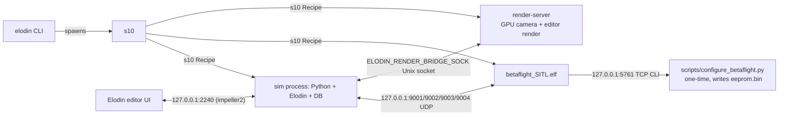
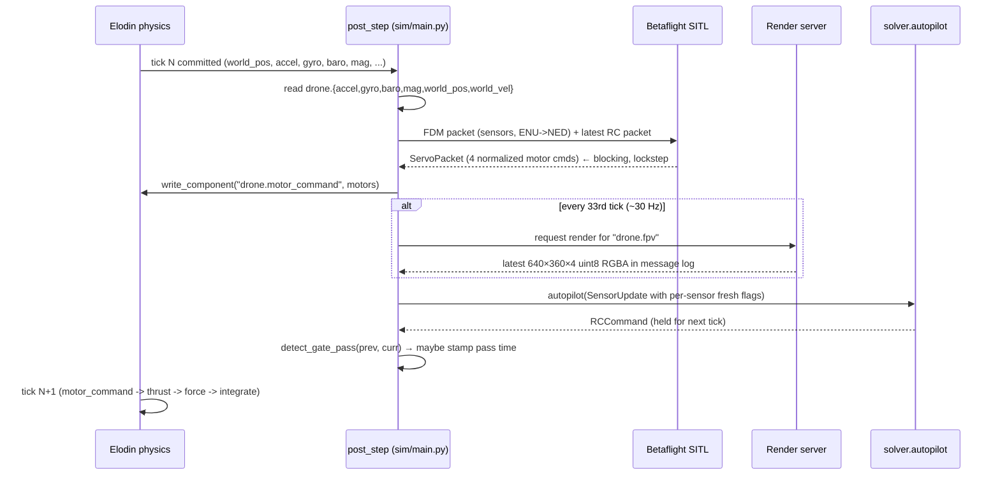

# Architecture

This document explains how the AI Grand Prix practice simulator is put together: the moving parts, why they are the way they are, and where to look when you want to change something. The [`README.md`](README.md) covers setup; this file covers design.

## Goals

The simulator exists so contestants can iterate on autonomy code _today_, before the official Anduril AI Grand Prix Virtual Qualifier 1 simulator is published. Concretely it tries to:

- Mirror the published [VADR-TS-002](https://www.theaigrandprix.com/) sensor and racecourse spec closely enough that perception code written against it will port with minimal change.
- Use a real Betaflight flight controller (SITL build), not a hand-rolled inner loop, so the control plant a contestant tunes against is the same plant the real airframe will run.
- Be transparent: deterministic physics, plain-text RC/PWM/UDP packets, viewable telemetry in the Elodin editor, no proprietary glue.
- Keep the contestant surface small. Everything competition-relevant lives in [`solver/`](solver/); the rest of the repo is "the simulator".

## Stack at a glance

| Layer | What it does | Where it lives |
|---|---|---|
| Physics + ECS + 3D editor | 6-DOF rigid body, multi-rate sensors, GPU-rendered viewport, in-process telemetry DB | [Elodin](https://github.com/elodin-sys/elodin) v0.17.2 (public binary + `pip install elodin==0.17.2`) |
| Flight controller | PID, mixer, attitude estimator, RC handling, arming | [Betaflight](https://github.com/betaflight/betaflight) `master`, built as the `SITL` target with `ENABLE_SIMULATOR_GYROPID_SYNC` |
| Process orchestration | Spawns / supervises / kills Betaflight when the sim starts | Elodin's `s10` recipe runner, declared from `sim/main.py` |
| FPV / editor render | GPU camera and editor viewport rasterization in a separate process | Elodin's render-server, started as an `s10` recipe |
| Bridge | UDP packet (de)serialization, lockstep handshake | [`sim/betaflight_bridge.py`](sim/betaflight_bridge.py) |
| Sensors | IMU / baro / mag noise + multi-rate sampling that hands FDM packets to Betaflight | [`sim/sensors.py`](sim/sensors.py) |
| Physics | Motor dynamics, body thrust, drag, ground constraint, integrator | [`sim/physics.py`](sim/physics.py) |
| Visualization | Editor-only propeller animation + per-motor thrust vectors | [`sim/visualization.py`](sim/visualization.py) |
| Race course | Gate placement, KDL visuals, host-side gate-pass detection | [`sim/course.py`](sim/course.py) |
| FPV camera | `sensor_camera` registration matching the AGP spec | [`sim/camera.py`](sim/camera.py) |
| Contestant API | `autopilot(update: SensorUpdate) -> RCCommand` | [`solver/`](solver/) |

The repo intentionally has no proprietary control loops or scoring service — Betaflight does the control, Elodin does the physics + render, and a single Python `post_step` callback wires them together.

## Process topology

Running `elodin editor sim/main.py` (or `elodin run sim/main.py`) produces this process graph:



Notes:

- The `sim` process embeds Elodin's telemetry DB; the editor connects over TCP `2240` to read components and stream RGBA frames.
- `s10` is Elodin's lightweight recipe / process runner. We register `Betaflight SITL` as a `PyRecipe.process` so it is started, watched, and killed alongside the sim.
- The render-server is also an `s10` recipe; it lives in a separate process so GPU rasterization for the FPV camera and editor viewport doesn't block the physics loop.
- Betaflight's TCP CLI on `5761` is only used once, by `scripts/configure_betaflight.py`, to write `eeprom.bin`. After that the sim talks to Betaflight purely via UDP.

## Lockstep cycle

The whole simulator is built around one callback registered with `world.run(..., post_step=sitl_post_step)`. It runs once per physics tick (1 kHz by default). The cycle deliberately avoids any wall-clock-dependent ordering.



A few details that matter:

- **Lockstep is enforced by Betaflight, not us.** Building Betaflight with `ENABLE_SIMULATOR_GYROPID_SYNC` makes its PID loop block on `FDM` packets, so a step in our `post_step` corresponds to exactly one PID iteration. `BetaflightSyncBridge.step()` blocks on the resulting motor packet (`timeout_ms=100`).
- **Bridge warmup.** On the first `post_step`, we sleep 2 s so Betaflight finishes gyro calibration, then send 500 dummy FDM packets at the default 1 kHz rate to walk it past its arming-disable checks.
- **Solver rate is decoupled from render rate.** The solver is called every physics tick with a `SensorUpdate`. Slow streams (baro, mag, FPV) expose `*_fresh` flags; Betaflight still receives a continuous RC/FDM stream even when no new frame is ready.
- **Camera render is requested at FPV rate.** `fpv_tick_interval = round(pid_rate / fpv_rate)` and the latest frame is collected from the message log. The current Elodin render request is synchronous on render ticks, but the solver and Betaflight paths no longer depend on a frame being available.
- **Motor write path.** `ctx.write_component("drone.motor_command", motors)` writes back into the same in-process DB Elodin reads from. The `motor_command` component is declared with `external_control: "true"` in [`sim/physics.py`](sim/physics.py), which tells Elodin not to overwrite it from the JIT-compiled physics graph.

## Coordinate frames and unit conventions

This is the part that is most likely to surprise you, so it gets its own section.

| Frame | Used by | Convention |
|---|---|---|
| ENU (East-North-Up) | Elodin world | +X = East / forward, +Y = North / left, +Z = Up |
| FLU (Forward-Left-Up) | Elodin body frame | Identical orientation labels to ENU, fixed to the airframe |
| NED (North-East-Down) | Betaflight FDM packets | +X = North, +Y = East, +Z = Down |
| FRD (Forward-Right-Down) | Betaflight gyro internals | Pitch axis is internally negated by `sitl.c` |
| Quaternion `[qx, qy, qz, qw]` | Elodin component layout | Scalar last in `world_pos[0..4]`; scalar first `[w, x, y, z]` in FDM packet |

Concrete consequences in code:

- `sim/sensors.py` and `sim/betaflight_bridge.py` flip the gyro pitch sign when packing FDM packets so Betaflight's internal negation cancels out and roll/pitch stay sensible.
- `sim/config.py::motor_positions` and `motor_spin_directions` are ordered `[BR, FR, BL, FL]` to match the **raw** Betaflight SITL motor output order. The yaw reaction signs (`[+1, -1, -1, +1]`) follow from that ordering.
- Visual prop spin in `sim/visualization.py` uses `[-1, +1, +1, -1]` because the geometric prop spin direction is the opposite of the reaction-torque sign that drives the airframe.
- The drone starts at `initial_position = (0, 0, 0.1)` in ENU. The `EASY_COURSE` is three vertical hoops at `(10, 0, 1.8)`, `(20, 0, 1.8)`, `(30, 0, 1.8)` — straight ahead along +X at hover altitude.

## Module reference

### `sim/main.py`

Entry point. Wires everything together:

1. Spawns the `drone` entity with `Body`, `Drone` (physics state), `DroneViz` (editor state), `IMU`, and `GateProgress` archetypes.
2. Registers the FPV `sensor_camera` and the editor schematic (KDL).
3. Composes `physics | sensors | visualization` into one `el.System`.
4. Registers Betaflight as an `s10` `PyRecipe.process`.
5. Defines `sitl_post_step` (the callback above) and calls `world.run(...)`.

### `sim/config.py`

Dataclass-based config for the airframe and the simulation. The default is a 5-inch racing quad mass / inertia, with:

- `simulation_rate` defines the Betaflight/physics lockstep rate, and `simulation_time = 15 s` defines the finite headless run length.
- Sensor rates labelled at the Aleph hardware bus rates (`gyro_rate`, `accel_rate`, `baro_rate`, `mag_rate`, `fpv_rate`). Sensors slower than `pid_rate` use `*_tick_interval` decimation in `sim/sensors.py`; faster nominal labels update every tick.
- The baseline solver uses a small baro/vertical-speed controller around a hover target; it is intentionally a smoke test, not a racing strategy.

There are also `create_5inch_racing_quad()`, `create_3inch_cinewhoop()`, and `create_7inch_long_range()` presets if you want to tune the practice rig to a different airframe.

### `sim/physics.py`

The deterministic physics graph. Every `@el.map` here gets JIT-compiled by Elodin's Cranelift backend and runs as part of the world tick:

- `motor_dynamics` — first-order lag from `motor_command` (0..1) to `motor_thrust` (N), with `tau = motor_time_constant`.
- `compute_body_thrust` — sums motor thrusts into `BodyThrust` (a `SpatialForce` with linear + torque components).
- `compute_drag` — quadratic drag based on world velocity.
- `apply_forces` — rotates body thrust to world frame, adds gravity + drag + angular damping, writes `el.Force`.
- `el.six_dof(dt, effectors, integrator=SemiImplicit)` — integrates Newton-Euler with the assembled effector pipeline.
- `ground_constraint` — clamps `z >= ground_level`, kills downward velocity at the ground, and applies altitude-blended angular damping so the drone doesn't tip on takeoff.
- `update_time` — increments `sim_time` for the editor.

### `sim/sensors.py`

Multi-rate IMU, barometer, and magnetometer. Each sensor has a `Noise` model (Gaussian measurement + bias drift) seeded by `(sensor_tick, channel)` so noise is fully reproducible. `SensorDataBuffer.build_fdm()` packages the latest readings into the binary `FDMPacket` Betaflight expects, including the ENU→NED conversion and the pitch-gyro sign flip. `sim/main.py` passes the same latest values to the solver every tick as a `SensorUpdate`, marking slower streams with `baro_fresh`, `mag_fresh`, and `frame_fresh`.

### `sim/betaflight_bridge.py`

UDP layer:

- Packet structs: `FDMPacket` (sensors, sim → BF), `RCPacket` (16 channels, sim → BF), `ServoPacket` / `ServoPacketRaw` (motors, BF → sim).
- `BetaflightSyncBridge` — the lockstep `step(fdm, rc) -> motors` path used by `sim/main.py`.
- Ports default to `9001` (raw PWM in), `9002` (normalized PWM in), `9003` (FDM out), `9004` (RC out).

### `sim/visualization.py`

Editor-only ECS components (`PropellerAngle`, `ThrustVizM0..M3`) and two `@el.map` systems that derive prop spin angles and per-motor thrust arrows from the `MotorThrust` component. They're added to the system pipeline (`physics | sensors | visualization`) but produce no force feedback — they exist purely so the schematic's `animate joint=` and `vector_arrow` declarations have data to bind to.

### `sim/course.py`

Defines the `Gate` dataclass and `EASY_COURSE` (three vertical hoops along +X). Renders spec-sized, high-contrast gates via `schematic_for(course)`: a 2.7 m outer / 1.5 m inner frame plus FPV-visible corner and rim accents. Detects passes host-side in `detect_gate_pass(prev, curr)` by checking the next-in-order gate plane crossing inside the inner 1.5 m × 1.5 m square. The `GateProgress` archetype carries `last_gate_passed` + `gate_pass_times` as `external_control` components so the host can write to them.

### `sim/camera.py`

Wraps `world.sensor_camera()`. Resolution and intrinsics match VADR-TS-002 §3.8 (640 × 360, fx = fy = 320, cx = 320, cy = 180, +20° upward tilt, 30 Hz target). The camera cadence is enforced by `DroneConfig.fpv_tick_interval` in the post-step. `request_render()` triggers Elodin's renderer on camera-rate ticks, and `collect_frame()` reads the latest frame from the message log for the next `SensorUpdate`.

> The spec lists those intrinsics alongside a prose "VFoV = 90°", which is internally inconsistent: the intrinsics give VFoV ≈ 58.72° and HFoV = 90°, so the prose is almost certainly mislabelling HFoV as VFoV. We honor the unambiguous intrinsics and derive `CAM_FOV_VERT_DEG` from `cy / fy` directly in [`sim/camera.py`](sim/camera.py); see [`context/agp-spec-reference.md`](context/agp-spec-reference.md) §5 for the full reasoning.

### `solver/`

The contestant surface:

- [`solver/api.py`](solver/api.py) — `SensorUpdate` (latest sensor values + freshness flags) and `RCCommand` (PWM µs).
- [`solver/baseline.py`](solver/baseline.py) — minimal arming + hover smoke test.
- [`solver/README.md`](solver/README.md) — full contract.

A different solver can be loaded without editing the simulator:

```bash
RACE_SOLVER=my_team.my_solver elodin editor sim/main.py
```

### `scripts/`

- `install_elodin.sh` — wraps the official curl installer for `elodin` and `elodin-db` v0.17.2.
- `fetch_betaflight.sh` — `git submodule update --init --recursive --depth 1 betaflight`.
- `build_betaflight.sh` — sets `ENABLE_SIMULATOR_GYROPID_SYNC` in Betaflight's `target.h`, builds the SITL ELF, with macOS-specific clang/`-no_compact_unwind` handling.
- `configure_betaflight.py` — one-time TCP CLI configuration that maps AUX1=ARM / AUX2=ANGLE, sets `pid_process_denom=1`, kills the 5 s power-on arming grace, disables `runaway_takeoff_prevention`, and saves to `eeprom.bin`. The committed `eeprom.bin` means most contributors never need to run this.
- `bf_cli_probe.py` — interactive helper for poking Betaflight's CLI when changing the configure script.

## Editor and visualization

The KDL schematic embedded in `sim/main.py` controls the editor layout, GLB binding, and timeline behaviour:

- `timeline follow_latest=#true` — the viewport playhead auto-jumps to the latest tick as the sim streams data. Without this, `object_3d` and `animate joint` evaluate at the playback timestamp (which starts at the recording's first sample) and the model appears frozen even though plots and `line_3d` trails update from time-series queries. This was the source of the long-running "viewport doesn't move" bug.
- `object_3d drone.world_pos { glb path="crazyflie.glb" ... }` — live-binds the GLB to the drone's `world_pos` component (quaternion + position).
- Four `animate joint="Root.Propeller_N"` directives map the four animated joints in `crazyflie.glb` to the `drone.propeller_angle` indices computed in `sim/visualization.py`. The index remap (joint 0 ← angle 1, joint 1 ← angle 3, joint 2 ← angle 2, joint 3 ← angle 0) reconciles the GLB's internal joint order with the `[BR, FR, BL, FL]` motor order.
- Four `vector_arrow "drone.thrust_viz_mN" body_frame=#true` declarations show per-motor downward thrust arrows scaled live by `MotorThrust`.
- A `line_3d frame="ENU" drone.world_pos` element draws the trajectory trail.
- A `Race` tab pairs the chase-cam viewport with the FPV `sensor_view` and key plots; a `Motors` tab carries motor thrust / command / propeller-angle / world-velocity graphs.

The chase camera is positioned `pos="drone.world_pos + (0,0,0,0, -3.5,0,1.5)"` so it tracks the drone in ENU.

## Determinism, timing, and tests

- The physics pipeline is JIT-compiled and fully deterministic for a given `start_timestamp`, config, and solver. Sensor noise is keyed on `(sensor_tick, channel)`, so re-running with the same code reproduces the same trajectory bit-for-bit.
- `world.run(..., start_timestamp=0)` zero-bases the editor timeline, which makes side-by-side runs comparable.
- `elodin-db export` (installed by `scripts/install_elodin.sh`) can dump any committed component to CSV / Parquet / Arrow IPC for offline inspection, e.g.:

  ```bash
  elodin-db query --eql "drone.world_pos, drone.motor_command" betaflight_db000
  ```

- Unit tests (`uv run pytest`, 35 tests) cover packet round-trips, gate-pass geometry, camera intrinsics, and the baseline solver. They do not touch the Elodin runtime, so they finish in < 1 s and can run in CI.
- `pyproject.toml` pins `elodin==0.17.2` so the Python bindings always match the locally installed CLI.

## Configuration knobs

Most knobs are dataclass fields on `DroneConfig` in `sim/config.py`. The handful that are environment-variable-controlled:

| Variable | Default | Effect |
|---|---|---|
| `RACE_SOLVER` | `solver.baseline` | Python module path of the solver loaded by `sim/main.py`. Must expose `autopilot(update: SensorUpdate) -> RCCommand`. |
| `ELODIN_VERSION` | `v0.17.2` | Version downloaded by `scripts/install_elodin.sh`. |
| `ELODIN_DB_PATH` | _unset_ | Optional DB output directory; if unset, `sim/main.py` auto-numbers `betaflight_db###`. |
| `ELODIN_DETAILED_TIMING` | _unset_ | Per-cycle phase-timing dump from Elodin's tick driver. Helpful when chasing real-time pacing issues. |

Run-level switches:

- `elodin editor sim/main.py` — interactive viewport; default workflow.
- `elodin run sim/main.py` — same simulation, `s10`-managed, no editor process.

## Layout

```text
sim/                  the simulator
  main.py             entry point (post_step lockstep, KDL schematic, world.run)
  config.py           DroneConfig + airframe presets
  physics.py          motor dynamics, body thrust, drag, ground, six_dof
  sensors.py          multi-rate IMU/baro/mag with noise; FDM packet builder
  betaflight_bridge.py UDP packets + BetaflightSyncBridge
  visualization.py    editor-only propeller / thrust components and systems
  camera.py           AGP-spec FPV sensor_camera registration
  course.py           gates, KDL renderer, host-side pass detection

solver/               the only directory contestants edit
  api.py              SensorUpdate / RCCommand
  baseline.py         arming + hover smoke test
  README.md           contract

scripts/              setup helpers (install_elodin, build/configure betaflight)
tests/                pytest suite (packets, course, camera)
assets/               crazyflie.glb (committed via Git LFS)
betaflight/           git submodule, built once into obj/main/betaflight_SITL.elf
eeprom.bin            committed Betaflight config (AUX1=ARM, AUX2=ANGLE)
```

## Where the AI Grand Prix spec lives in code

| AGP spec (VADR-TS-002, Issue 00.02) | In this repo |
|---|---|
| Camera 640 × 360, fx = fy = 320, cx = 320, cy = 180 (VFoV ≈ 58.72°), +20° up-tilt, 30 Hz | [`sim/camera.py`](sim/camera.py) |
| Gate inner 1.5 m × 1.5 m, outer 2.7 m × 2.7 m × 0.26 m | [`sim/course.py`](sim/course.py) |
| MAVLink-style RC + PWM control | [`sim/betaflight_bridge.py`](sim/betaflight_bridge.py) |
| No GPS, no depth, no motor RPM, no battery SoC in telemetry | [`solver/api.py`](solver/api.py) |
| 8-minute max run | `simulation_time` in [`sim/config.py`](sim/config.py) |
| Time-trial scoring with gate ordering | [`sim/course.py`](sim/course.py) (`detect_gate_pass`, `print_summary`) |

## Opportunities for improvement

The simulator hits its goal of giving contestants a working practice rig today, but there is a lot of room to grow before it's a faithful stand-in for the official Virtual Qualifier 1. Listed roughly in order of value × effort.

### Fidelity to the AGP spec

- **Match airframe to the announced AGP reference platform** (chassis 280 × 280 × 160 mm, 5″ props, declared mass) once it's published. Right now `DEFAULT_CONFIG` is a generic 5″ racer.
- **Atmospheric model.** Drag is a single quadratic coefficient; turbulence, ground effect, and rotor wash are absent. A Dryden gust model and simple ground effect would make low passes far more realistic.
- **Battery model + voltage sag.** Motor max thrust is constant; in real flight it droops with cell voltage and that completely changes lap pacing late in a race.

### Course and scoring

- **Multi-course library.** We ship `EASY_COURSE` (straight 3-gate). Real qualifier-style courses (banked turns, vertical chicanes, split-S) should be one constructor per course in `sim/course.py`.
- **Penalty model.** Gate-pass detection is binary "did we cross the inner square?". Adding edge / strut collisions, missed-gate penalties, and DSQ-on-collision would let solvers train against the real scoring rules.
- **Procedural courses + curriculum.** A simple seeded course generator would let RL/IL pipelines train against unlimited variations.

### Solver ergonomics

- **Pluggable sensor channels.** `SensorUpdate` is currently a fixed dataclass. A registration mechanism would let teams pull in baro derivatives, attitude estimates, etc. without forking the sim.
- **Solver lifecycle hooks.** Today only `autopilot(update)` is called. Adding `on_start(config)` and `on_finish(summary)` would let solvers warm caches, load weights, and emit per-run reports.
- **Async / batched solvers.** The solver runs synchronously in the post-step. A non-blocking variant (returning `Future[RCCommand]` and reusing the previous command if it isn't ready) would let teams run heavier perception models without slowing the physics tick.
- **Built-in attitude estimate from FDM**, exposed in `SensorUpdate`. Teams shouldn't need to re-implement Madgwick on day one.

### Tooling and observability

- **GitHub Actions CI.** Run `uv run pytest` on every PR; optional matrix for macOS + Linux. The test suite already runs in < 1 s with no Elodin runtime needed, so this is essentially free.
- **Lap leaderboard / replay diff.** A short script that re-runs N solvers against the same `start_timestamp` and produces a comparison table + CSV would make iteration hugely faster.
- **Editor screenshot regression.** Capture a viewport screenshot at a fixed tick and diff against a reference; would have caught the "object_3d frozen at t=0" bug we hit this week long before a human noticed.
- **Headless smoke job for Betaflight builds.** Builds + configures + runs the 15 s sim, asserts on `[RACE]` summary line. Would catch upstream Betaflight regressions early.

### Performance

- **Real-time at 1 kHz.** The current run is close to real-time but still sensitive to camera rendering + DB commit cost. Reducing `telemetry_rate` below `simulation_rate` (Elodin supports this; we don't expose it yet) would let the editor stream cleanly at 1× without losing physics resolution.
- **Camera frame zero-copy.** Today `ctx.read_msg()` returns bytes that we copy into a NumPy array. Wiring it through `np.frombuffer` with a writable=False view would shave a noticeable copy at 30 Hz.

### Reproducibility and packaging

- **Pin Betaflight to a tagged release** (currently `master`). Submodule churn has bitten us once already; a tagged version with a documented bump cadence is safer.
- **Cross-platform CI for `scripts/build_betaflight.sh`.** macOS + Ubuntu LTS + Fedora. The current script has macOS-specific clang flags but is otherwise generic.
- **Docker / dev-container image.** A single container with the Elodin CLI, `uv`, build tools, and a pre-built Betaflight ELF would let new contestants skip the 10-minute setup entirely.

### Documentation

- **Tutorial: writing your first solver.** Walk a reader from `solver.baseline` to a thresholded-image gate-tracker. The current `solver/README.md` is a contract, not a tutorial.
- **Coordinate-frame cheat sheet.** ENU/FLU/NED/FRD plus quaternion layout in one place. Most of this lives in code comments in `sim/sensors.py` and `sim/betaflight_bridge.py`; surfacing it would save real time.
- **Profiling recipe.** Document `ELODIN_DETAILED_TIMING=1` + `elodin-db query` + the `[BetaflightSyncBridge]` summary line as a "is the sim healthy?" runbook.
