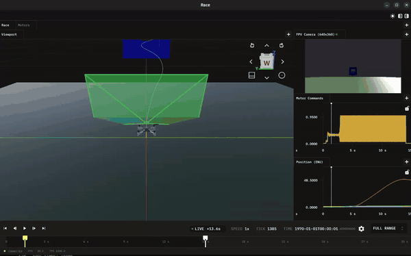

# AI Grand Prix Playground

An open-source, Elodin-based practice simulator for [Anduril's AI Grand Prix](https://www.theaigrandprix.com/), a $500K autonomous drone-racing competition. Built so contestants can iterate on perception, planning, and control code today, while the official Virtual Qualifier 1 simulator finishes baking.

<p align="center">
  
</p>

What you get out of the box:

- High-fidelity 6-DOF physics from [Elodin](https://github.com/elodin-sys/elodin) (deterministic, GPU-rendered, multi-rate sensors) around a generic 5-inch racing quad, our best public guess until the reference airframe is published.
- A real **Betaflight SITL** flight controller in lockstep with the physics, talking standard MAVLink-style RC + PWM over UDP.
- A forward FPV camera matching the AI Grand Prix tech-spec intrinsics (640×360, fx=fy=320, cx=320, cy=180, +20° up-tilt, 30 Hz).
- A 3-gate forward course in Elodin's ENU frame (+X/East), with automatic pass-time tracking.
- A clean [`solver/`](solver/) package. That's the only directory you edit to compete.

## Quick start (macOS / Ubuntu / Windows WSL, ~5 minutes)

You need `uv`, `git`, `git lfs` and a C toolchain for building Betaflight:

On macOS install the Xcode Command Line Tools (`xcode-select --install`).

On Windows:
- open Powershell as admin
- edit a new file with `notepad "$env:USERPROFILE\.wslconfig"`
- set the wsl network config with:
```bash
[wsl2]
networkingMode=mirrored
```
- and run `wsl --install`, which will start a new WSL distro

On Ubuntu/WSL run:
```bash
sudo apt update && sudo apt -y install build-essential clang-18 libasound2t64 git-lfs curl
```

Finally install uv:
```bash
curl -LsSf https://astral.sh/uv/install.sh | sh
```

Clone this repository and then:

```bash
# 1) Install the Elodin CLI (editor + run + db)
bash scripts/install_elodin.sh

# 2) Set up the Python environment
uv venv --python 3.13 && source .venv/bin/activate && uv sync

# 3) Fetch and build Betaflight SITL (one-time)
git submodule update --init --recursive --depth 1 betaflight
bash scripts/build_betaflight.sh

# 4) Configure Betaflight only if the committed eeprom.bin is missing or stale.
#    This is normally a no-op for a fresh clone.
uv run python scripts/configure_betaflight.py

# 5a) on Mac / Ubuntu, open the simulation in the Elodin editor to start sim and connect editor directly
elodin editor sim/main.py

# 5b) start just the simulation in WSL
elodin run sim/main.py
# then open a new Powershell, download & install the Elodin windows release binary
curl --proto '=https' --tlsv1.2 -LsSf https://github.com/elodin-sys/elodin/releases/download/v0.17.3/elodin-installer.sh | sh
# clone the repo there as well, and run
elodin.exe editor 127.0.0.1:2240
```

After `scripts/build_betaflight.sh`, `git status` may show `M betaflight`. That is expected: the build script toggles Betaflight's `target.h` inside the submodule to enable simulator lockstep.

Expected output on a healthy run:

```text
[SOLVER] using module: solver.baseline
[FPV] First frame at tick 33: 921600 bytes, shape=(360, 640, 4)
SUCCESS: SITL integration working! Drone took off!
[RACE] course=easy gates_passed=0/3 lap_time=15.00s status=DNF pass_times=[--,--,--]
```

## Writing your solver

Edit [`solver/baseline.py`](solver/baseline.py) or point at your own module:

```bash
RACE_SOLVER=my_team.my_solver elodin editor sim/main.py
```

The full contract (one `autopilot(update: SensorUpdate) -> RCCommand` function) is in [`solver/README.md`](solver/README.md).

## Inspecting a run

Each run writes an auto-numbered `betaflight_db###` directory at the repo root (set `ELODIN_DB_PATH` to override). A couple of `elodin-db` commands you'll reach for after a run:

```bash
# Dump every committed component to flat, joined CSVs (one row per tick).
elodin-db export betaflight_db000 --format csv --flatten --join -o dbs/betaflight_db000-csv

# Render the FPV camera stream to a video file for offline inspection.
elodin-db export-videos betaflight_db000 -o betaflight_db000-video
```

The CSV form is convenient for regression diffs, offline plotting, or pulling state into a notebook. For lighter-weight queries on individual components without writing files, `elodin-db query --eql ...` hits the same DB; see [`ARCHITECTURE.md`](ARCHITECTURE.md#determinism-timing-and-tests) for the syntax.

## Running tests

```bash
just test     # or: uv run pytest
just verify   # check the latest run log for a successful takeoff
just clean    # remove betaflight_db### directories and CSV/video exports
```

36 tests across packet round-trips, course geometry, camera intrinsics, and the baseline solver. All run in well under a second (no Elodin runtime needed).

## Going deeper

- [`ARCHITECTURE.md`](ARCHITECTURE.md): full design covering the lockstep cycle, coordinate frames, module reference, editor schematic, configuration knobs, and known opportunities for improvement.
- [`solver/README.md`](solver/README.md): the autopilot contract.
- The Elodin engine, editor, and Python bindings live at [`elodin-sys/elodin`](https://github.com/elodin-sys/elodin); read its README for the full surface area, including the `sensor_camera` and `StepContext` APIs we lean on here.

## Acknowledgements

Built on top of the upstream [`elodin-sys/elodin/examples/betaflight-sitl`](https://github.com/elodin-sys/elodin/tree/main/examples/betaflight-sitl), [`examples/sensor-camera`](https://github.com/elodin-sys/elodin/tree/main/examples/sensor-camera), and [`examples/crazyflie-edu`](https://github.com/elodin-sys/elodin/tree/main/examples/crazyflie-edu) examples. Not affiliated with Anduril, DCL, Neros, or JobsOhio. The AI Grand Prix is theirs; this practice rig is community fan-art so contestants can start hacking now.

## License

[Apache 2.0](LICENSE), the same license as the upstream [Elodin engine](https://github.com/elodin-sys/elodin).
